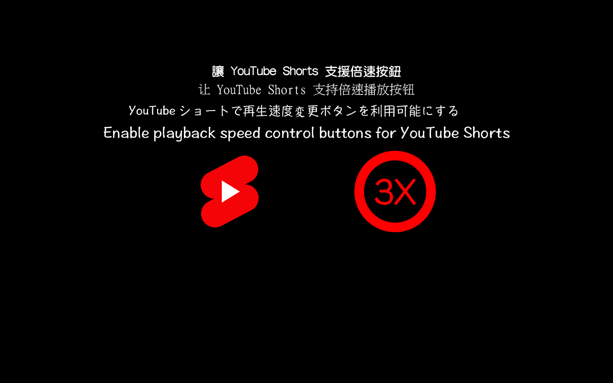

# [B.M] YouTube Shorts 倍速

[](https://developer.chrome.com/docs/extensions/mv3/)
[](https://www.youtube.com/shorts/)
[](https://github.com/BoringMan314/bm-youtube-shorts-3x)
[](LICENSE)

適用於 **[YouTube Shorts](https://www.youtube.com/shorts/)**（`youtube.com/shorts/*`）的瀏覽器擴充功能：新增**倍速**按鈕，點擊依序切換 **1×、1.5×、2×、3×**，以 `HTMLVideoElement.playbackRate` 實際變速。

*适用于 **[YouTube Shorts](https://www.youtube.com/shorts/)**（`youtube.com/shorts/*`）的浏览器扩展：新增**倍速**按钮，点击依次切换 **1×、1.5×、2×、3×**，以 `HTMLVideoElement.playbackRate` 实际变速。*  

* **[YouTube Shorts](https://www.youtube.com/shorts/)**（`youtube.com/shorts/*`）向けのブラウザ拡張機能：**倍速**ボタンを追加し、クリックで **1×、1.5×、2×、3×** を順に切り替え、`HTMLVideoElement.playbackRate` で実際に再生速度を変更します。*  

*A browser extension for **[YouTube Shorts](https://www.youtube.com/shorts/)** (`youtube.com/shorts/*`): adds a **playback speed** button; click to cycle **1×, 1.5×, 2×, 3×**, using `HTMLVideoElement.playbackRate` to change speed.*

> **聲明**：本專案為第三方輔助工具，與 Google／YouTube 官方無關。使用請遵守各服務條款與著作權規範。

---



---

## 目錄

- [功能](#功能)
- [系統需求](#系統需求)
- [安裝方式](#安裝方式)
- [本機開發與測試](#本機開發與測試)
- [技術概要](#技術概要)
- [專案結構](#專案結構)
- [版本與多語系](#版本與多語系)
- [隱私說明](#隱私說明)
- [維護者：更新 GitHub 與 Chrome 線上應用程式商店](#維護者更新-github-與-chrome-線上應用程式商店)
- [授權](#授權)
- [問題與建議](#問題與建議)

---

## 功能

- **倍速切換**：預設 **1×**，點擊依序 **1× → 1.5× → 2× → 3× → 1×**。
- **版面**：掛在 **Shorts 播放器覆蓋層**（`ytd-reel-player-overlay-renderer`／`#shorts-player`）內，與**喜歡**同一條直欄，並維持在喜歡列**正上方**（DOM 上為喜歡列的上一個兄弟節點）。
- **外觀**：按鈕樣式貼近未按讚的 **yt-spec** 圓形鈕（淺色半透明底），並可鏡像原生喜歡鈕的計算後顏色。
- **留言開啟時**：僅在 Shorts 影片操作區搜尋錨點，**不會**誤用留言區內的按讚節點。

---

## 系統需求

- **Chrome** 或 **Microsoft Edge**（Chromium）等支援 **Manifest V3** 的瀏覽器。

---

## 安裝方式

### 從 Chrome 線上應用程式商店（若已上架）

上架後可於 [Chrome Web Store](https://chromewebstore.google.com/) 搜尋 **「[B.M] YouTube Shorts 倍速」** 安裝。

### 從原始碼載入（開發人員模式）

1. 點選本頁綠色 **Code** → **Download ZIP** 解壓，或使用 Git 複製：`git clone https://github.com/BoringMan314/bm-youtube-shorts-3x.git`。
2. 開啟 Chrome 或 Edge，前往 `chrome://extensions`（Edge：`edge://extensions`）。
3. 開啟「開發人員模式」→「載入未封裝項目」→ 選取含 [`manifest.json`](manifest.json) 的**專案根目錄**。
4. 開啟任一 Shorts 頁面（網址為 `https://www.youtube.com/shorts/...`），確認右側喜歡鈕**上方**出現倍速鈕。

---

## 本機開發與測試

修改 [`content.js`](content.js) 或 [`content.css`](content.css) 後，在 `chrome://extensions` 對本擴充按 **重新載入**，再重新整理 Shorts 分頁即可驗證。

---

## 技術概要

- **內容腳本** [`content.js`](content.js) 於 `document_idle` 注入，僅匹配 `https://www.youtube.com/shorts/*` 與 `https://youtube.com/shorts/*`。
- **錨點**：在 **`ytd-reel-player-overlay-renderer`** 或 **`#shorts-player`** 子樹內尋找喜歡按鈕，避免與留言區 `#like-button` 混淆；掛載於 **`reel-action-bar-item-view-model`**（或等價列）之前。
- **倍速**：設定 `video.playbackRate`／`defaultPlaybackRate`，並在切換 Short、`loadedmetadata`、`playing` 等時重套；必要時於 **Shadow DOM** 內注入與 [`content.css`](content.css) 對應的樣式字串。
- **權限**：未宣告 `host_permissions`；以 `content_scripts.matches` 限縮網址。

---

## 專案結構

| 路徑 | 說明 |
|------|------|
| [`manifest.json`](manifest.json) | Manifest V3、`content_scripts`、圖示與版本號 |
| [`content.js`](content.js) | 掛載 UI、倍速邏輯、DOM／影片監聽 |
| [`content.css`](content.css) | 主文件樹內樣式（Shadow 內由腳本另行注入對應規則） |
| [`_locales/`](_locales/) | 多語系（`zh_TW`、`zh_CN`、`ja`、`en`） |
| [`privacy-policy.html`](privacy-policy.html) | 隱私權政策（上架商店所需之公開網頁） |
| [`icons/`](icons/) | 擴充功能圖示（16／48／128 px） |
| [`screenshot/`](screenshot/) | 商店與說明用截圖 |
| [`LICENSE`](LICENSE) | MIT |

**Chrome Web Store 常用截圖尺寸參考**：

| 檔案 | 用途 |
|------|------|
| `screenshot_440x280.png` | 小型宣傳圖 |
| `screenshot_1280x800.png` | 寬螢幕截圖 |
| `screenshot_1280x800.psd` | 寬螢幕截圖原始檔（Photoshop） |
| `screenshot_1400x560.png` | 大型宣傳圖 |

---

## 版本與多語系

- **版本號**：定義於 [`manifest.json`](manifest.json) 的 `version`（目前 **0.1.0**）。
- **預設語系**：繁體中文（`zh_TW`）。

---

## 隱私說明

本擴充功能**不蒐集、不上傳**任何個人資料或瀏覽記錄；未使用任何分析工具或遠端程式碼。僅在本機頁面內操作影片播放速度。詳細內容請參閱 [`privacy-policy.html`](privacy-policy.html)。

**上架提醒**：提交至 Chrome Web Store 時，須於後台填寫隱私實踐聲明，並提供該政策頁面的**公開 HTTPS 網址**（可將 [`privacy-policy.html`](privacy-policy.html) 以 [GitHub Pages](https://pages.github.com/) 託管，例如 `https://boringman314.github.io/bm-youtube-shorts-3x/privacy-policy.html`，實際網址以你啟用 Pages 後為準）。

---

## 維護者：更新 GitHub 與 Chrome 線上應用程式商店

### 更新至 GitHub

**Bash / Git Bash / PowerShell：**

```powershell
git add .
git commit -m "docs: 更新內容說明與商店連結"
git push origin main
```

### 更新至 Chrome 線上應用程式商店

請透過 [Chrome Web Store 開發人員控制台](https://chrome.google.com/webstore/devconsole) 手動上傳更新：

1. **遞增版本**：修改 `manifest.json` 中的 `version`（例如從 `0.1.0` 提升至 `0.1.1`）。
2. **封裝套件**：將專案內容壓縮為 ZIP 檔。
   - **必要檔案**：`manifest.json`、`content.js`、`content.css`、`privacy-policy.html`、`icons/`、`_locales/`、`LICENSE`。
   - **排除檔案**：`.git/`、`.gitignore`、`screenshot/`、`README.md`、`*.psd`、`*.zip`、`*.url`。
3. **上傳審核**：在控制台選擇項目 →「套件」→「上傳新套件」。
4. **提交送審**：檢查文案、截圖與隱私資訊無誤後，點擊「提交送審」。

---

## 授權

本專案以 [MIT License](LICENSE) 授權。

---

## 問題與建議

歡迎透過 [GitHub Issues](https://github.com/BoringMan314/bm-youtube-shorts-3x/issues) 回報錯誤或提出改善建議（回報時請提供瀏覽器版本、介面語言與重現步驟）。
